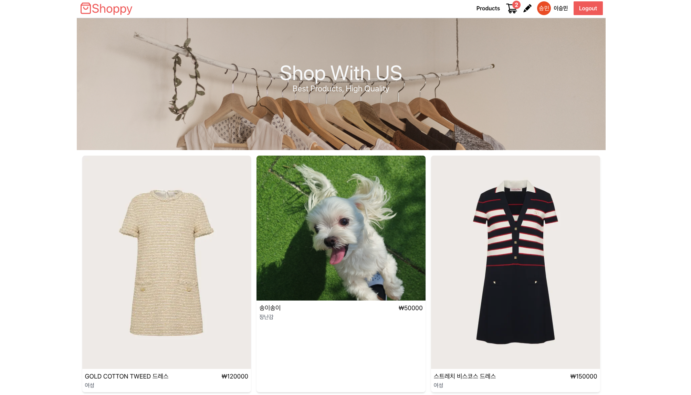
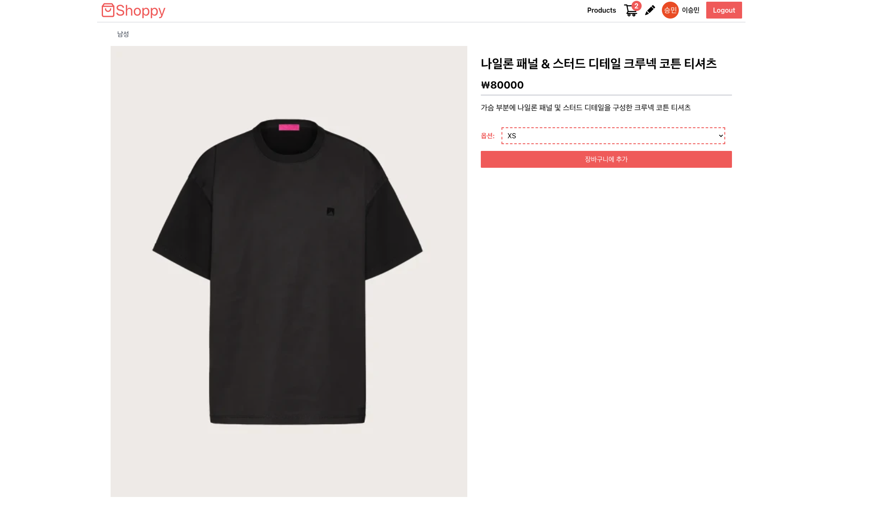
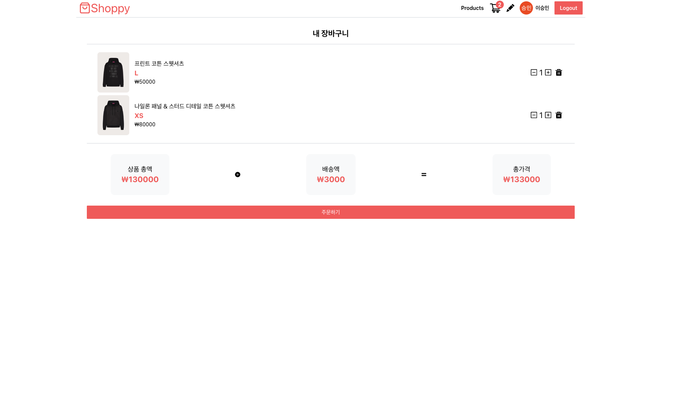
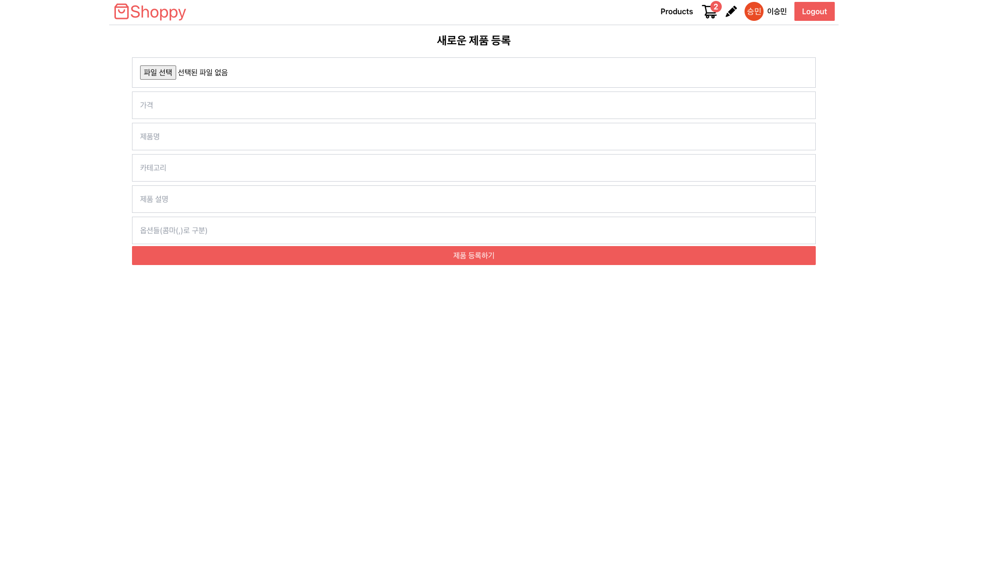

# 쇼핑몰 사이드 프로젝트 (My-Shoppy)

About Main Tech 

1. Firebase, Cloudinary 사용
2. 구글 로그인, 로그아웃 인증기능 구현
3. Context Api를 이용한 전역 상태관리  

Netlify deployment: https://my-shoppy.netlify.app/
(프로젝트 배포시 로그인 창에서 "App domain is unauthorized" 관련 이슈: Firebase의 해당 프로젝트의 Authorized domains 섹션에서 도메인을 직접 추가하는 것으로 해결.)

# 프로젝트 메인 화면

# 상세페이지

# 장바구니 페이지

# 관리자 상품등록 페이지 
